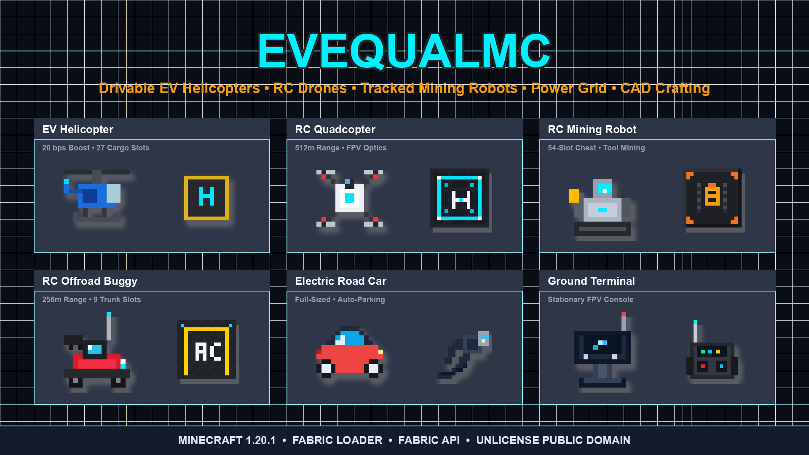

<div align="center">
  

  # ⚡ EvecualMC
  **High-tech electric vehicles, autonomous robotics, aerospace helicopters, power systems, and advanced machinery for Minecraft 1.20.1 (Fabric).**

  [](https://fabricmc.net)
  [](https://fabricmc.net)
  [](https://modrinth.com/mod/fabric-api)
  [](CHANGELOG.md)
  [](https://adoptium.net)
  [](LICENSE)
  [](https://modrinth.com/mod/evecualmc)
  [](https://github.com/Lunar-Entertainment/EvecualMC)

</div>

---

## 📖 Overview

**EvecualMC** is an engineering, power, and vehicular automation mod for **Minecraft 1.20.1 (Fabric)**. Designed from the ground up with realistic physics, custom models, and industrial energy networks, EvecualMC allows you to build, pilot, and automate everything from drivable aerospace helicopters and full-sized electric cars to long-range autonomous RC mining droids, automated defense turrets, and wireless power grids.

---

## 🌟 Key Highlights & Features

### 🚁 Drivable EV Helicopters & VTOL Aerodynamics
- **VTOL Flight Physics**: Vertical take-off and landing. Hold `Space` to ascend, `Shift` to descend, and steer with `W/A/S/D`. Tap `Ctrl` for high-speed sprint propulsion (up to 20 blocks/second).
- **Dynamic Visuals**: Animated 4-blade main and tail rotors with motion blur, responsive nose pitch tilt during forward acceleration, and banking roll on turns.
- **Custom Livery & Glass Tinting**: Dye the fuselage using standard Minecraft Dyes (6 livery variants) and customize the cockpit canopy with 12 Stained Glass shades.
- **Cargo & Logistics**: Built-in 27-slot cargo bay accessible by pressing `Z`. Active chunk loading ensures safe aerial travel across long distances.
- **Automated Rapid Helipad Recharging**: Dock onto a **Heli Charger** connected to your grid for automated hands-free fast charging (300 EU/s).

### 🚗 Full-Sized Electric Cars
- High-speed, 2.0-block wide road vehicles with responsive steering and suspension.
- Trunk cargo storage for road trips and resource hauling.
- Automatic parking alignment with **Parking Lines** blocks and **Car Charger** stations.
- Full color customization with vehicle dyes.

### 📡 Radio-Controlled (RC) Robotic Fleet
Operate remote drones and robots without risking player safety using handheld telemetry controllers or ground command terminals:
- **🏎️ RC Car / Buggy (256m range)**: Swift all-terrain scouting vehicle with 9-slot trunk and wireless charging support.
- **🚁 RC Quadcopter Drone (512m range)**: Real-time FPV camera mode with smooth 1x–5x scroll zoom, lateral strafing (`A`/`D`), togglable spotlights (`L`), 9-slot cargo, altitude hold, and autonomous auto-docking return (`C`).
- **🤖 RC Excavator Robot (256m range)**: Caterpillar-tracked industrial utility droid equipped with a **54-slot chest**, auto-vacuum drop collection, tool equipping (Pickaxes, Axes, Shovels, Swords), remote left-click block mining, and 1.25m step-height climbing.

### ⚡ Electric Power Grid & Infrastructure
Construct complete multi-tier electrical grids to power your facilities and vehicles:
- **Generation**: Clean daytime **Solar Panels** and high-altitude **Wind Turbines**.
- **Energy Storage**: Modular **Battery Storage Units** with dynamic network coordination.
- **Power Cables**: Ultra long-range **Power Wires** supporting multi-node power transmission across up to 1,024 blocks without short circuits.
- **Charging Stations**: **Car Chargers**, **Heli Chargers**, and **Wireless Inductive RC Chargers** with 16-block broadcast fields.
- **Material Processing**: **Electric Grinder**, **Electronic Duper**, **Item Charger**, and **Materializer**.

### 🎯 Automated Stationary Turrets & Base Defense
- **Ballistic Predictive Leading**: Calculates projectile velocity and target trajectory to lead fast-moving targets accurately.
- **Player Filtering**: Integrated `[⚙ Targets]` and `[👥 Filter]` GUI supporting **Whitelist** and **Blacklist** player gametag modes for multiplayer safety.
- **Dedicated Ammo Logistics**: Wirelessly linkable to **Turret Ammo Containers** for continuous automated rearming with Elactorite and kinetic munitions.

### 🌌 Lorentz Railgun & The Evecual Dimension
- **Lorentz Railgun**: High-velocity electromagnetic kinetic weapon.
- **Ignite Mode (`Shift + 5`)**: Toggles the railgun into dimensional rift ignition mode.
- **Elactorite Blocks**: Decorative and structural crystal blocks crafted from Elactorite crystals that act as dimensional conduits.
- **Evecual Dimension (`evecualmc:evecual`)**: Pristine, peaceful superflat dimension devoid of natural mob spawns and structure clutter—ideal for testing, automation, and industrial super-factories.

### 👑 Dedicated Crown Equipment Slot
- Isolated cosmetic and functional headwear slot revealed when hovering over the inventory head.
- Custom 3D modeled crowns with zero slot-ID collisions, fully compatible with third-party inventory mods such as Trinkets, Traveler's Backpack, and Elytra Slot.

### 🎵 High-Fidelity Soundtrack Discs
- **"Circuit & Stone"**: Synth-infused electronic industrial track (Comparator output: 14).
- **"Voltage Valley"**: Melodic electronic beat (Comparator output: 15).

### 📐 Electronic Combiner (CAD Blueprint Crafting)
- 240px slate-900 technical workstation interface featuring 2D vector CAD schematics.
- Strict component socket validation for vehicle engines, antenna relays, optical sensors, and chassis plates.
- Ghost hologram outlines guide physical component placement with real-time status diagnostics.

### ✨ Visual Polish & EvecualTechShader
- Built-in shader pack optimized for Iris/Canvas with volumetric god rays, SSAO, clearcoat vehicle reflections, and animated Gerstner water.
- Seamless connected glass, connected bookshelves, and glowing emissive ore veins.

---

## 🎮 Keybindings & Controls Quick Reference

| Action | Key / Control | Context |
| :--- | :---: | :--- |
| **Open Field Guide / Diagnostics** | `H` | Global or aiming at any EvecualMC machine |
| **Camera View Toggle (FPV / Chase)** | `F` or `RMB` | Active RC Controller link |
| **Toggle Vehicle Spotlights / Lights** | `L` | EV Helicopter / RC Vehicles |
| **Access Vehicle Cargo Bay** | `Z` | Near vehicle or piloting |
| **Auto-Return & Docking** | `C` | RC Drone / RC Robot / RC Car |
| **Camera Zoom (FPV & Orbit)** | `Scroll Wheel` | Active Camera View (`F`) |
| **Orbit Camera Angle** | `Arrow Keys` / `Mouse` | Active Camera View (`F`) |
| **Helicopter Sprint Boost (20 bps)** | `Ctrl` | Piloting EV Helicopter |
| **Helicopter Ascend / Descend** | `Space` / `Shift` | Piloting EV Helicopter |
| **Railgun Mode Toggle (Standard / Ignite)** | `Shift + 5` | Holding Lorentz Railgun |

---

## 📦 Requirements & Installation

### Requirements
- **Minecraft**: `1.20.1`
- **Fabric Loader**: `>= 0.15.11`
- **Fabric API**: `>= 0.92.2+1.20.1`
- **Java**: `Java 17` or higher

### Installing for Players
1. Install **Fabric Loader for 1.20.1** on your launcher (Modrinth App, Prism Launcher, CurseForge, or official Minecraft Launcher).
2. Download **Fabric API** and the latest **EvecualMC** `.jar` from [Modrinth](https://modrinth.com/mod/evecualmc) or [GitHub Releases](https://github.com/Lunar-Entertainment/EvecualMC/releases).
3. Place both `.jar` files into your `.minecraft/mods` folder.
4. Launch Minecraft and start engineering!

---

## 🛠️ Developer & Contributor Quick Start

### 1-Click Launching
Launch Minecraft 1.20.1 with the mod pre-loaded directly from the workspace:

#### Windows Batch:
```cmd
launch.bat
```
*(or double-click `launch.bat` in Windows Explorer)*

#### PowerShell:
```powershell
.\launch.ps1
```

#### Gradle CLI:
```cmd
.\gradlew runClient
```

### Auto-Install to Your Local Minecraft Launcher
Compile the latest version and automatically deploy it to your `%APPDATA%\.minecraft\mods\` directory:
```cmd
launch.bat --install
```
*or*
```powershell
.\launch.ps1 -Install
```

### Compiling the Release JAR
```cmd
.\gradlew build
```
The compiled, remapped release JAR will be generated at:
```
build/libs/evecualmc-1.8.38.jar
```

---

## 📁 Repository Structure

```
EvecualMC/
├── build.gradle                               # Gradle build configuration with Fabric Loom 1.7.4
├── gradle.properties                          # Minecraft 1.20.1, Yarn mappings, and mod version
├── settings.gradle                            # Project name and repository declarations
├── launch.bat                                 # Windows 1-click build & launcher script
├── launch.ps1                                 # PowerShell automation launcher
├── evecualmc_banner.png                       # Official mod showcase banner
├── evecualmc_logo.png                         # High-res mod logo
├── src/
│   └── main/
│       ├── java/com/evecual/evecualmc/
│       │   ├── EvecualMC.java                 # Mod initializer & registry (items, blocks, packets)
│       │   ├── block/                         # Solar panels, wind turbines, chargers, turrets, cables
│       │   │   └── entity/                    # BlockEntity logic, energy networks, inventory handlers
│       │   ├── entity/                        # Vehicle physics (EV Heli, Car, RC Buggy/Drone/Robot)
│       │   ├── item/                          # Tools, components, blueprints, railgun, crowns
│       │   ├── client/                        # Client initializer, HUD overlays, camera managers
│       │   │   ├── render/                    # 3D block & vehicle entity renderers
│       │   │   └── screen/                    # GUI screens (CAD Combiner, Turrets, Storage Units)
│       │   ├── mixin/                         # Core mixin integrations (Crown slot, controls)
│       │   └── turret/                        # Ballistics math & target filtering systems
│       └── resources/
│           ├── fabric.mod.json                # Fabric mod metadata, entrypoints, dependencies
│           ├── evecualmc.mixins.json          # Mixin registry
│           ├── assets/evecualmc/              # Models, blockstates, textures, sounds, lang files
│           └── data/                          # Recipes, loot tables, advancements, dimension json
├── msc/                                       # High-fidelity soundtrack master tracks
├── shader/                                    # EvecualTechShader Iris-compatible shader pack
└── run/                                       # Isolated Minecraft dev runtime directory
```

---

## 📄 License & Credits

- **Author**: Lunar Entertainment
- **License**: [The Unlicense](LICENSE) (Public Domain Dedication). Feel free to use EvecualMC in any modpack, server, or custom project.
- **Repository**: [github.com/Lunar-Entertainment/EvecualMC](https://github.com/Lunar-Entertainment/EvecualMC)
- **Modrinth**: [modrinth.com/mod/evecualmc](https://modrinth.com/mod/evecualmc)
